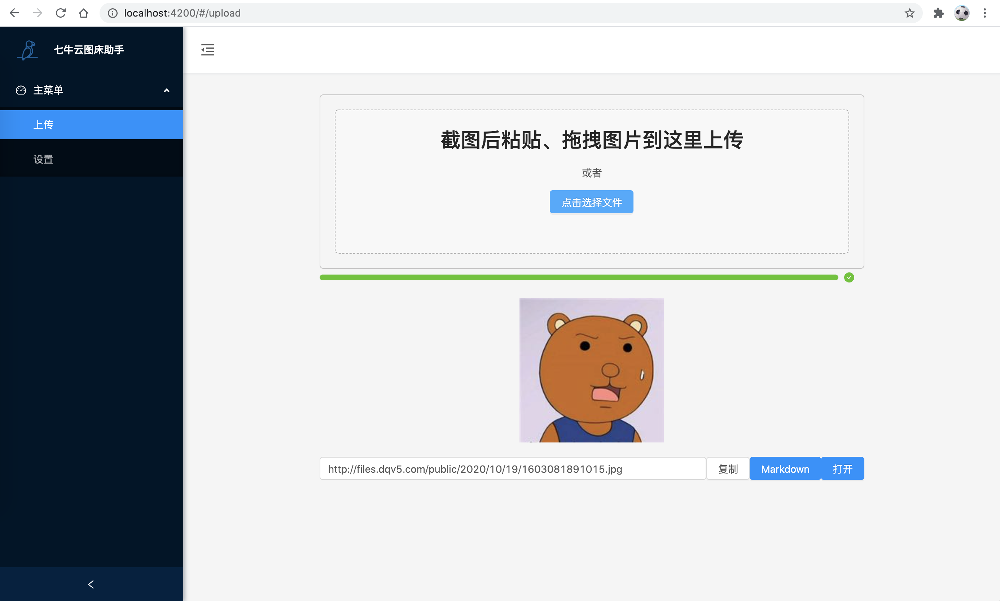
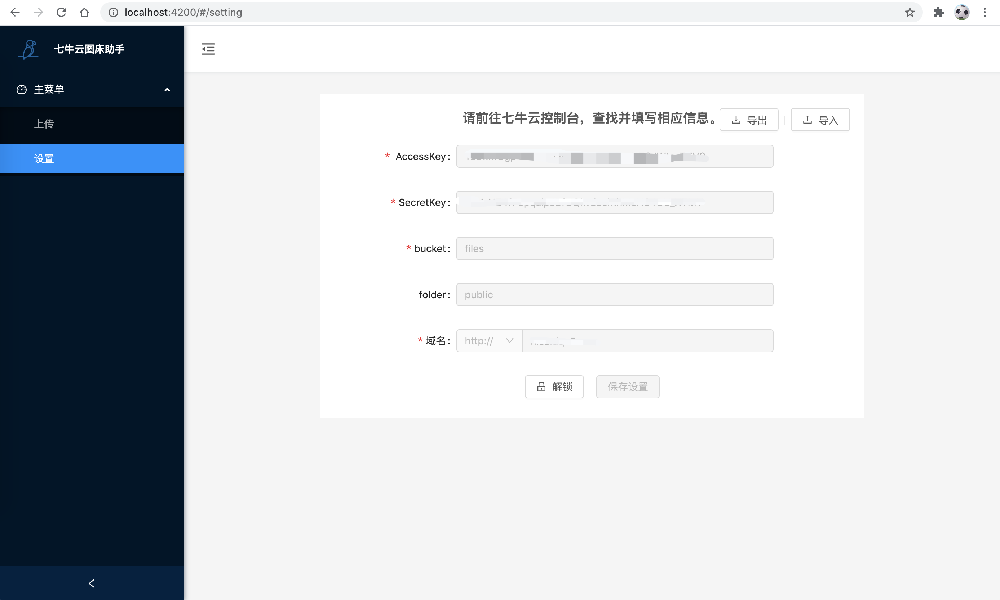

# 七牛云图床助手

## 简介

纯前端项目，能将图片上传到七牛云空间，并生成图片链接，方便在博客中引用。

### 上传界面


### 设置界面



## 本地运行

```bash
npm install
npm start
```

## 打包

```bash
npm install
npm run build
```

## 技术栈

 - [angular](https://angular.cn)
 - [ng-zorro](https://ng-zorro.gitee.io)
 - [七牛云sdk](https://developer.qiniu.com/kodo/sdk/javascript)
 - [CryptoJS](https://www.npmjs.com/package/cryptojs)

